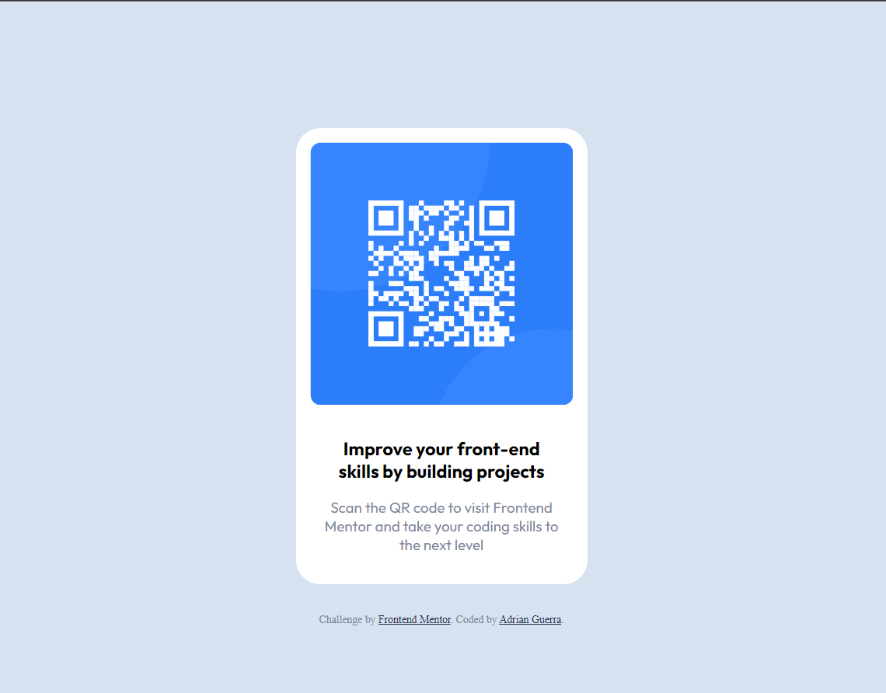

# Frontend Mentor - QR code component solution

This is a solution to the [QR code component challenge on Frontend Mentor](https://www.frontendmentor.io/challenges/qr-code-component-iux_sIO_H). Frontend Mentor challenges help you improve your coding skills by building realistic projects. 

## Table of contents

- [Overview](#overview)
  - [Screenshot](#screenshot)
  - [Links](#links)
- [My process](#my-process)
  - [Built with](#built-with)
  - [What I learned](#what-i-learned)
  - [Useful resources](#useful-resources)
- [Author](#author)


## Overview

### Screenshot



### Links

- Solution URL: [https://www.frontendmentor.io/solutions/qr-code-component-using-html-css-REu_9vVyv2](https://www.frontendmentor.io/solutions/qr-code-component-using-html-css-REu_9vVyv2)
- Live Site URL: [https://qr-code-component-gray-sigma.vercel.app/](https://qr-code-component-gray-sigma.vercel.app/)

## My process

### Built with

- Semantic HTML5 markup
- CSS custom properties
- Flexbox

### What I learned

In this project, I learned to separate the element from the text it contains when it pertains to the box model. In order to center an element, I reinforced the notion of using margins, as "text-align" only applies to the text within an element and not the element itself. By using margins, I could center the element within its parent container.

```html
<!-- Add div for card container -->
  <div class="card">

    
    <h3>Improve your front-end<br> skills by building projects</h3>
    <p>Scan the QR code to visit Frontend<br> Mentor and take your coding skills to<br> the next level</p>

  </div>
```
```css
.card {
  margin: 130px auto auto auto;
}
```

### Useful resources

- [w3schools](https://www.w3schools.com/) - This site helped me quickly look up attributes that I had forgotten, and also see examples of how they are applied. A pretty great resource in general.

## Author

- LinkedIn - [Adrian Guerra](https://www.linkedin.com/in/adrian-guerra-a210a4196/)
- Frontend Mentor - [@adie9](https://www.frontendmentor.io/profile/adie9)

